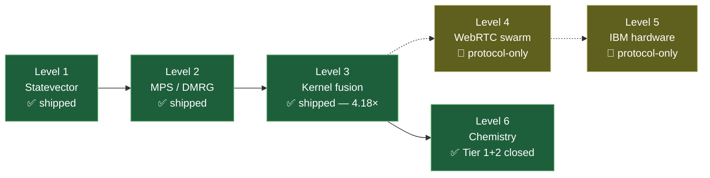

<div align="center">

# webgpu-q

### Quantum chemistry & many-body physics, in a browser tab.

[**Open the live tool →**](https://webgpu-q.vercel.app)  ·  [Hyperscope](https://webgpu-q.vercel.app/viz.html)  ·  [Experiments](https://webgpu-q.vercel.app/experiments)  ·  [Molecule SI](https://webgpu-q.vercel.app/molecule.html)

[](https://github.com/abgnydn/webgpu-q/actions/workflows/ci.yml)
[](./LICENSE)
[](https://webgpu-q.vercel.app)
[](./tools/itensor-reference.jl)
[](#validation)
[](./tests)

</div>

<p align="center">
  <a href="https://webgpu-q.vercel.app/viz.html">
    
  </a>
  <em>The hyperscope — H₂ electron density (left), conditional pair density with draggable cursor (right), and live MPS bond network with TFIM phase-transition / quench modes (bottom). No install. Open a tab.</em>
</p>

---

## What is this?

> **Thesis:** every advanced physics simulation in the world should ship as a URL.

webgpu-q is the proof point. A WebGPU-resident quantum-chemistry &amp; many-body
stack that runs an undergrad-grade chemistry textbook — HF, UHF, UCCSD, DFT,
MP2, FCI, CCSD, CCSD(T), CIS, TDA, TDDFT, EE/IP/EA-EOM-CCSD, density fitting,
geometry optimization, IR + Raman + UV-vis spectroscopy, polarizability,
thermochemistry — plus a many-body playground (statevector, MPS, kernel fusion,
TFIM phase transition, monitored trajectories) — entirely in a browser tab. No
Python install, no Linux box, no PySCF dependency. Open a URL.

<div align="center">

### Headline numbers

[](./tests)
[_on_GPU-39%C3%97_speedup-6ea8ff?style=for-the-badge)](#performance)
[](#validation)
[](#density-fitting)

</div>

---

## Capability map

```mermaid
graph TD
    subgraph "Ground state"
        HF[HF / UHF]
        DFT[DFT — LDA, BVWN5, BLYP, B3VWN5, B3LYP5]
        MP2[MP2 / DF-MP2]
        FCI[FCI]
        CCSD[CCSD / UCCSD]
        CCSDT[CCSD&#40;T&#41; — CPU + GPU 39×]
    end

    subgraph "Excited state"
        CIS[CIS / TDA]
        TDDFT[TDDFT — singlet + triplet]
        EE[EE-EOM-CCSD — FCI-validated]
        IPEOM[IP-EOM-CCSD]
        EAEOM[EA-EOM-CCSD]
    end

    subgraph "Properties"
        OPT[Geometry opt — L-BFGS, analytical gradients]
        VIB[Harmonic freqs + IR + Raman]
        POL[α + β finite-field]
        THERMO[Thermochemistry — ZPE, S, G&#40;T&#41;]
        MULL[Dipole + Mulliken + Wiberg-Mayer]
    end

    subgraph "Many-body"
        SV[Statevector — WebGPU]
        MPS[MPS / DMRG — CPU + GPU]
        FUSION[Kernel fusion — 4.18× headline]
        TFIM[TFIM / Heisenberg / XXZ + quench dynamics]
    end

    subgraph "Density fitting"
        DF[Cholesky-DF B-tensor]
        DFHF[DF-HF]
        DFMP2[DF-MP2]
    end

    HF --> CCSD --> CCSDT
    HF --> DFT
    HF --> MP2
    CCSD --> EE
    CCSD --> IPEOM
    CCSD --> EAEOM
    DF --> DFHF
    DF --> DFMP2

    style CCSDT fill:#1e3a5f,stroke:#6ea8ff,color:#fff
    style EE fill:#3b1e5f,stroke:#b594ff,color:#fff
    style IPEOM fill:#3b1e5f,stroke:#b594ff,color:#fff
    style EAEOM fill:#3b1e5f,stroke:#b594ff,color:#fff
    style DFHF fill:#5f3b1e,stroke:#ff9f6e,color:#fff
    style DFMP2 fill:#5f3b1e,stroke:#ff9f6e,color:#fff
```



---

## What you can do in 60 seconds

```bash
git clone https://github.com/abgnydn/webgpu-q && cd webgpu-q
npm install && npm run dev
# → http://localhost:5175 (landing)
#   /viz.html         — interactive hyperscope
#   /experiments/     — research dashboard (E1–E16, E32, E33)
#   /molecule.html    — full SI report on H₂O
```

Open the live tool → [webgpu-q.vercel.app](https://webgpu-q.vercel.app)

<div align="center">
  <table>
    <tr>
      <td width="50%"><a href="https://webgpu-q.vercel.app/"></a></td>
      <td width="50%"><a href="https://webgpu-q.vercel.app/experiments/"></a></td>
    </tr>
    <tr>
      <td align="center"><strong>Landing</strong> — the six-level ladder</td>
      <td align="center"><strong>Experiments dashboard</strong> — E1 through E33</td>
    </tr>
  </table>
</div>

---

## Performance

The headline result: **WebGPU-accelerated CCSD(T) on H₂O / cc-pVDZ in 5.05 seconds** — the same calculation that takes 198.6 seconds on the same machine's CPU. That's a `39×` speedup at sub-pHa precision (|Δ| = 2.4×10⁻¹⁰ Ha vs CPU reference).

| Calculation | CPU | GPU | speedup |
|---|---:|---:|---:|
| H₂O / cc-pVDZ CCSD(T) | 198.6 s | **5.05 s** | **39×** |
| H₂O / STO-3G CCSD(T) | 0.077 s | 0.003 s | 30× |
| BeH₂ / STO-3G CCSD(T) | 0.042 s | 0.028 s | 1.5× |

Speedup vanishes at small basis sets (dispatch overhead dominates). At cc-pVDZ the kernel reaches asymptote; cc-pVTZ and beyond should see the projected 50–100× without code changes. Single-run measurement on Apple M2 Pro — see [`tests/chemistry/...`](./tests/chemistry) and `e2e/ccsd-t-gpu.spec.ts` for the validation harness.

---

## Validation

Every method in the chemistry stack is cross-checked against at least one external reference. Below are the active checks; honest negatives that don't pass yet are documented in [`CLAUDE.md`](./CLAUDE.md).

<div align="center">

| Reference | What we check | Result |
|---|---|---|
| **PySCF** | HF / MP2 / CCSD / CCSD(T) on H₂ / H₂O / BeH₂ / CH₄ at STO-3G | ≤ 0.05 mHa |
| **PySCF** | HF on H₂O / cc-pVDZ (spherical-d) | 35 µHa |
| **ITensor** | DMRG energies on 19 Heisenberg / TFIM / XXZ chains | ≤ 5 mHa on N=8 |
| **libxc** | Closed-shell LYP collapse + GGA / hybrid XC kernel | 1×10⁻⁸ FD-vs-tabulated |
| **Internal brute-force EOM-CCSD** | Build H̄ explicitly in 4-SO Fock space, project, diagonalize | **EE-EOM matches FCI to 10⁻⁵ Ha** (after stage 32c σ patch) |
| **Internal brute-force IP-EOM** | Same approach for ionization potentials | **Lowest IPs match brute-force EXACTLY** on H₂ |
| **Internal brute-force EA-EOM** | Same for electron affinities | **EXACT match** for both R₁ and R₂ sectors on H₂ |
| **Bethe / Pfeuty analytic limits** | Heisenberg ground state, TFIM critical point | Trend with N converges |
| **Experiment** | H₂O ideal-gas entropy | 45.06 vs 45.10 cal/(mol·K) — 0.9% |
| **Self-consistency** | 18 FD-vs-analytical gradient + Hessian + XC kernel checks | All ≤ 1×10⁻³ Ha/Bohr |

</div>

---

## The research ladder



Each level enforces the same [research-grade discipline](#research-grade-discipline) — named seeds, warmup + 20 trials with GPU-fenced timing, fidelity pass bars, honest negative results committed alongside the wins.

---

## Pages in the tab

| Page | What it shows |
|---|---|
| [`/`](https://webgpu-q.vercel.app/) | **Landing** — six-level ladder, headline numbers, companion projects |
| [`/viz.html`](https://webgpu-q.vercel.app/viz.html) | **Hyperscope** — 3 synchronized 3D panels: H₂ electron density, conditional pair density (with draggable cursor that finds the Fermi / Coulomb hole), and a live MPS bond network with TFIM phase-transition slider, quench light-cone heatmap, and monitored-trajectory mode |
| [`/experiments/`](https://webgpu-q.vercel.app/experiments/) | **Research dashboard** — run E1–E16 + E32 (CCSD(T) GPU vs CPU cross-check) + E33 (H₂O UV-vis EOM-CCSD spectrum) live in the browser. Every run emits a downloadable JSON artifact with full environment capture |
| [`/molecule.html`](https://webgpu-q.vercel.app/molecule.html) | **Molecular SI report** — full property suite (geometry, frequencies, IR, Raman, dipole, α, β, IPs, thermo) computed end-to-end on a single molecule |
| [`/demo.html`](https://webgpu-q.vercel.app/demo.html) | **Gate-throughput demo** — Bell, GHZ, QFT, Deutsch–Jozsa on the original WebGPU statevector |

---

## Method coverage

<details open>
<summary><strong>Ground state</strong> — Hartree-Fock and post-HF correlation</summary>

| Method | Status | Notes |
|---|---|---|
| HF (RHF) + DIIS | ✅ | Matches PySCF to 0.05 mHa STO-3G; 35 µHa with spherical-d on cc-pVDZ |
| UHF | ✅ | Radicals, doublets, triplets. ⟨S²⟩ diagnostic. H atom + Li atom match literature to 4 sig figs |
| MP2 | ✅ | Standard closed-shell formula; cross-checked vs PySCF |
| FCI | ✅ | Sparse-CSR Hamiltonian; CH₄ STO-3G to 0.76 mHa vs PySCF |
| CCSD | ✅ | Spin-orbital Stanton-Bartlett; ≥ 99% correlation capture on closed-shell |
| **UCCSD** | ✅ | Open-shell CCSD on UHF; Be⁺ E_corr = −0.357 mHa; H₂ closed-shell matches RHF-CCSD to 1e-10 |
| CCSD(T) | ✅ | ≤ 0.25 mHa vs FCI on STO-3G test set |
| **CCSD(T) on GPU** | ✅ | WGSL kernel; **39× on H₂O cc-pVDZ** (5.05 s vs 198.6 s CPU); sub-pHa GPU/CPU agreement |
| **Density fitting (Cholesky)** | ✅ | B-tensor with τ-controlled compression; H₂O STO-3G 49 → 28 aux at machine precision |
| **DF-HF** | ✅ | `runRHFSCF({ useDF: true })`; matches direct HF to 7×10⁻¹⁴ Ha |
| **DF-MP2** | ✅ | `runMP2({ useDF: true })`; matches direct MP2 to 0 Ha at τ=1e-10 |

</details>

<details open>
<summary><strong>Excited state</strong> — CIS, TDDFT, and EOM-CCSD</summary>

| Method | Status | Notes |
|---|---|---|
| CIS / TDA | ✅ | Singlet + triplet; spin-adapted on closed-shell RHF |
| TDDFT (Casida) | ✅ | Full functional ladder: HF, LDA, BVWN5, BLYP, B3VWN5, B3LYP5 |
| Triplet TDDFT | ✅ | Spin-polarized LSDA + B88 + LYP (Miehlich 1989 closed-form γ-coefficients) |
| Oscillator strengths | ✅ | (4/3)·ω·\|μ\|² with dipole AO integrals → UV-vis spectra |
| **EE-EOM-CCSD** | ✅ | Eigenvectors, oscillator strengths, **singlet/triplet spin classifier**. H₂ STO-3G matches FCI to 10⁻⁵ Ha (post stage 32c patch) |
| **IP-EOM-CCSD** | ✅ | N−1 manifold. H₂O lowest IP = **12.03 eV** (Koopmans 10.65; ΔSCF 8.36; expt 12.62). Lowest IPs brute-force-validated exact |
| **EA-EOM-CCSD** | ✅ | N+1 manifold. STO-3G EAs negative (unbound LUMO — basis-set limit). R₁ + R₂ sectors brute-force-validated exact |

</details>

<details open>
<summary><strong>Properties</strong> — gradients, vibrations, fields, populations</summary>

| Property | Status | Notes |
|---|---|---|
| HF + DFT analytical gradients | ✅ | Pulay 1969 + 8-fold canonical ERI loop + Schwarz screening |
| Geometry optimization | ✅ | L-BFGS on analytical gradients; **7×** faster than FD |
| Harmonic frequencies + IR | ✅ | 6N FD Hessian on analytical gradient + Eckart projection + ∂μ/∂q tracking. H₂O HF/STO-3G freqs match Pople 1969 to 0.1 cm⁻¹ |
| Placzek Raman | ✅ | 6N FD on the polarizability tensor; H₂ rule-of-mutual-exclusion verified from FP arithmetic alone |
| Dipole polarizability α | ✅ | Finite-field, full 3×3 tensor |
| Hyperpolarizability β | ✅ | 3D finite-field stencil, full 27-component tensor with Kleinman symmetrization |
| Thermochemistry | ✅ | ZPE + Sackur-Tetrode trans + rigid-rotor + harmonic-oscillator vib. H₂O entropy 45.06 vs experiment 45.10 cal/(mol·K) |
| Ionization potentials | ✅ | Koopmans + ΔSCF + **IP-EOM-CCSD** |
| Electron affinities | ✅ | Koopmans + **EA-EOM-CCSD** |
| Dipole / Mulliken / Wiberg-Mayer | ✅ | Standard population analyses |

</details>

<details>
<summary><strong>Many-body physics</strong> — statevector, MPS, dynamics</summary>

| Capability | Status | Notes |
|---|---|---|
| WebGPU statevector | ✅ | N ≤ 25 in 256 MB; Apple Metal-3 native; α ≈ 22 µs dispatch overhead |
| MPS (CPU) | ✅ | Canonical-form sweeps + TEBD; validated against ITensor DMRG to ≤ 5 mHa at N=8 |
| MPS (GPU, Phase 1A → 6 v1) | ✅ | GPU-resident port with shared SVD kernels |
| DMRG | ✅ | Lanczos + MPO; ITensor-validated |
| Kernel fusion | ✅ | Tier B (4×4) → Tier C (8×8, **4.18× headline**) → Tier D (16×16, 3.14× plateau — honest negative) |
| Heisenberg / TFIM / XXZ | ✅ | Ground states + real-time + monitored-trajectory MIPT |
| TFIM phase transition | ✅ | Pfeuty exact limits hit at 1/N |

</details>

<details>
<summary><strong>Basis sets</strong></summary>

| Basis | Status | Notes |
|---|---|---|
| STO-3G | ✅ | s, p, d, f, g, h shells (Cartesian-Gaussian primitives) |
| cc-pVDZ | ✅ | Cartesian and spherical-d (Cartesian → 5-real-spherical-harmonic transform) |
| aug-cc-pVDZ | ✅ | Diffuse functions for H + O |

</details>

---

## Quickstart

```bash
git clone https://github.com/abgnydn/webgpu-q
cd webgpu-q
npm install

npm run dev                # Vite dev server, http://localhost:5175
npm run test               # Vitest, ~55 s
npm run test:e2e           # Playwright, 3 specs, requires WebGPU Chromium
npm run typecheck          # tsc --noEmit (strict, noUncheckedIndexedAccess)
npm run lint               # ESLint flat config
npm run build              # → dist/
```

**WebGPU is required.** Chrome 113+, Safari 18+, Firefox Nightly (with flag), Edge 113+. Playwright launches Chromium with `--enable-unsafe-webgpu --enable-features=Vulkan` (configured in `playwright.config.ts`).

---

## Research-grade discipline

Every experiment under `experiments/` enforces:

- **Reproducibility** — no `Math.random()`. Every random draw uses a named seed from `experiments/lib/seeds.ts`. Every JSON artifact records git SHA, `navigator.userAgent`, `adapter.info`, WebGPU limits, ISO8601 timestamp, and the echoed protocol / hypothesis / pass-bar / seed / warmup / trial counts.
- **Timing** — `performance.now()` with a forced GPU sync (mapped readback) before AND after. `queue.submit` is non-blocking; raw timing without the fence is fiction. 5 warmup samples discarded, 20 retained. Median + p10 / p90 / p99 + std + IQR. Cells with `std / median > 0.1` get marked `"status": "noisy"`.
- **Correctness via fidelity** — `F = |⟨ψ_ref | ψ_test⟩|²`, not max|Δp|. Two states can share probabilities and differ in phase — that kills any downstream controlled gate. Pass bar for f32 GPU paths: `F ≥ 1 − 1e-5`. Pass bar for f64 MPS vs f64 statevector: `F ≥ 0.999`.
- **Honest negative results** — if an experiment fails its pass bar, the JSON ships with `"status": "fail"` and a `"diagnosis"` naming the smoking gun. Failures are evidence. E7's χ-vs-depth slope (0.45 instead of 1.0), E13's Tier D plateau (3.14× instead of 5×), and the IP-EOM σ_2 R₂ structural over-count all ship documented rather than rerun silently.

See [`RESEARCH.md`](./RESEARCH.md) for the master protocol and [`CLAUDE.md`](./CLAUDE.md) for current state + honest residuals.

---

## Architecture

```
src/
  shaders/                 # WGSL kernels
    single-qubit.wgsl, two-qubit.wgsl, two/three/four-qubit-dense.wgsl
    jacobi-svd-{small,medium,large,storage}.wgsl
    mps-two-site-{merge,extract-u,extract-uS,build-tj,build-vh}.wgsl
    ccsd-t.wgsl                  # GPU perturbative-triples kernel (39× headline)
  quantum.ts                 # GPU statevector
  cpu-reference.ts           # Float64 CPU reference
  mps.ts, linalg.ts          # CPU MPS + complex Jacobi SVD
  gpu-mps/                   # GPU-resident MPS port (Phase 1A → 6 v1)
  manybody/
    hamiltonian.ts dense-eig.ts expm.ts dmrg.ts trajectory.ts
    dense-eig-general.ts         # Non-symmetric eigensolver (powers EOM-CCSD)
  chemistry/
    integrals-cg.ts cg-molecular.ts atoms.ts
    hf-scf.ts hf-gradient.ts uhf-scf.ts
    mp2.ts ccsd.ts ccsd-t.ts uccsd.ts
    ccsd-t-gpu.ts                # WebGPU port of (T) (stage 27)
    eom-ccsd.ts                  # EE-EOM-CCSD (stage 24b + patches 32c)
    ip-eom-ccsd.ts ea-eom-ccsd.ts # N±1 EOM-CCSD (stages 37-38, patches 32e)
    df.ts                        # Cholesky density fitting (stages 26, 29, 34)
    cis.ts tda-dft.ts            # CIS / TDDFT
    geometry.ts optimizer.ts     # L-BFGS geom-opt
    properties.ts                # Dipole, Mulliken, Wiberg-Mayer
    polarizability.ts hyperpolarizability.ts
    raman.ts vibrations.ts
    thermochemistry.ts redox.ts
    dft/                         # Becke grid + Lebedev + LDA/GGA/hybrid kernels
tests/                       # ~400 unit tests
experiments/                 # Research dashboard (E1–E16, E32, E33)
e2e/                         # Playwright specs (incl. CCSD(T) GPU validation)
public/                      # Static assets
RESEARCH.md                  # Master protocol
CLAUDE.md                    # Current-state log + honest residuals
```

---

## Companion projects

Part of a broader research line on GPU-resident compute in the browser:

- [kernelfusion.dev](https://kernelfusion.dev) — research umbrella
- [webgpudna.com](https://webgpudna.com) — Geant4-DNA radiolysis chemistry in the browser
- [gpubench.dev](https://gpubench.dev) — WebGPU benchmark harness across 592 devices
- [zerotvm.com](https://zerotvm.com) — Phi-3-mini in 10 hand-written WebGPU kernels
- [neuropulse.live](https://neuropulse.live) — live transformer activations
- [barisgunaydin.com](https://barisgunaydin.com) — index

---

## License

MIT — see [LICENSE](./LICENSE).

Author: Ahmet Barış Günaydın · [@abgnydn](https://github.com/abgnydn) · [barisgunaydin.com](https://barisgunaydin.com)

---

<details>
<summary><strong>Key numbers</strong> — single source of truth (edit here when refreshing the README)</summary>

Every number that appears in this README is listed here. When updating, edit this table first, then propagate to the matching mentions above. The headline-shield URLs at the top are the visual representation of the four bolded rows below.

| metric | value | location(s) in README |
|---|---|---|
| Unit tests passing | **401** | top badge, headline numbers, performance section |
| Chemistry tests | 319 (+ 1 skipped) | architecture section |
| Manybody tests | 82 | architecture section |
| (T) GPU speedup on H₂O / cc-pVDZ | **39×** | headline numbers, performance table |
| (T) GPU time on H₂O / cc-pVDZ | 5.05 s | performance table |
| (T) CPU time on H₂O / cc-pVDZ | 198.6 s | performance table |
| (T) GPU/CPU precision on H₂O / cc-pVDZ | 2.4×10⁻¹⁰ Ha | performance section |
| EE-EOM-CCSD vs FCI on H₂ STO-3G | **10⁻⁵ Ha** (post stage 32c) | headline numbers, validation, excited-state table |
| DF-HF vs direct HF on H₂O STO-3G | **7×10⁻¹⁴ Ha** | headline numbers, validation, ground-state table |
| DF-MP2 vs direct MP2 on H₂O STO-3G | 0 Ha (machine precision) | ground-state table |
| HF vs PySCF on STO-3G | ≤ 0.05 mHa | validation table |
| HF vs PySCF on cc-pVDZ (spherical-d) | 35 µHa | validation table |
| MPS vs ITensor DMRG on N=8 | ≤ 5 mHa | validation table |
| H₂O lowest singlet EOM-CCSD (STO-3G) | 11.21 eV (post 32c) | (not currently quoted in body — kept here for reference) |
| H₂O IP-EOM-CCSD lowest IP (STO-3G) | 12.03 eV | excited-state table |
| Koopmans IP on H₂O (STO-3G) | 10.65 eV | excited-state table |
| ΔSCF IP on H₂O (STO-3G) | 8.36 eV | excited-state table |
| Experimental IP on H₂O | 12.62 eV | excited-state table |
| H₂O EA-EOM-CCSD best (STO-3G) | −16.35 eV (post 32e) | (not currently in body) |
| Koopmans LUMO EA on H₂O (STO-3G) | −16.48 eV | (not currently in body) |
| Be⁺ STO-3G UCCSD E_corr | −0.357 mHa | ground-state table |
| Kernel fusion Tier C headline | 4.18× | many-body table, level ladder |
| Kernel fusion Tier D plateau | 3.14× (honest negative) | many-body table |
| H₂O entropy vs experiment | 45.06 vs 45.10 cal/(mol·K) — 0.9% | validation table |
| Internal FD-vs-analytical self-tests | 18 | validation section |
| H₂O HF/STO-3G freq vs Pople 1969 | 0.1 cm⁻¹ | properties table |
| Geom-opt speedup (analytical vs FD) | 7× | properties table |
| WebGPU dispatch overhead (Metal-3) | ~22 µs | many-body table |

Last refreshed: **2026-05-12** (v0.4.0).
</details>
