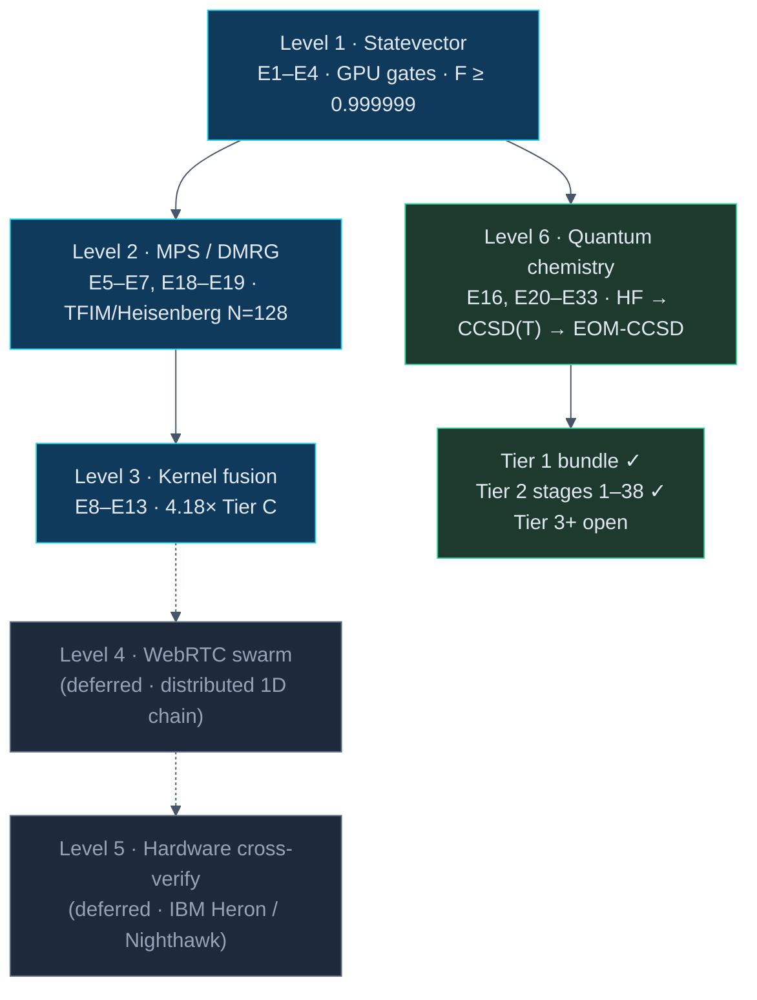

```mermaid
%%{init: {'theme':'dark', 'themeVariables': {'primaryColor':'#1e1b4b','primaryTextColor':'#e2e8f0','primaryBorderColor':'#7c3aed','lineColor':'#64748b','fontFamily':'ui-monospace, monospace'}}}%%
graph LR
    A["<b>Ground state</b><br/>HF · UHF · DIIS<br/>DFT LDA/GGA/hybrid<br/>MP2 · DF-MP2"]
    B["<b>Correlation</b><br/>CCSD closed+open<br/>CCSD(T) CPU+GPU<br/>FCI · CASCI"]
    C["<b>Excited states</b><br/>CIS · TDA · TDDFT<br/>EE-EOM-CCSD<br/>IP/EA-EOM-CCSD"]
    D["<b>Properties</b><br/>dipole · α · β<br/>IR · Raman · thermo<br/>Mulliken · Wiberg"]
    E["<b>Geometry</b><br/>analytical ∇<br/>BFGS opt<br/>vib analysis"]
    F["<b>Density fitting</b><br/>Cholesky CD-DF<br/>DF-HF · DF-MP2<br/>7e-14 Ha gap"]
    G["<b>Many-body sim</b><br/>statevector<br/>MPS · TEBD · DMRG<br/>kernel fusion"]

    A --> B --> C
    A --> D
    A --> E
    A -.-> F
    F -.-> B
    G -.-> A

    style A fill:#1e1b4b,stroke:#22d3ee
    style B fill:#1e1b4b,stroke:#34d399
    style C fill:#1e1b4b,stroke:#c084fc
    style D fill:#1e1b4b,stroke:#fbbf24
    style E fill:#1e1b4b,stroke:#f472b6
    style F fill:#1e1b4b,stroke:#06b6d4
    style G fill:#1e1b4b,stroke:#a78bfa
```

<div align="center">


<br/>

<a href="https://webgpu-q.vercel.app"></a>
&nbsp;
<a href="https://webgpu-q.vercel.app/molecule.html"></a>
&nbsp;
<a href="https://webgpu-q.vercel.app/experiments/"></a>

<br/><br/>


</div>

<br/>

<table align="center" border="0">
<tr>
<td align="center" width="800">

**A research-grade quantum chemistry + many-body physics engine that runs entirely in a browser tab.**

No install. No backend. No CUDA. Open a URL and get HF · UHF · DFT · MP2 · CCSD · CCSD(T) · EOM-CCSD on real molecules — with GPU acceleration via WebGPU.

</td>
</tr>
</table>

<br/>

---

<h3 align="center">📸 &nbsp; See it</h3>

<table align="center">
<tr>
<td align="center" width="33%">
<a href="https://webgpu-q.vercel.app"></a>
<br/><sub><b>landing</b> · what the engine is + run-anywhere CTAs</sub>
</td>
<td align="center" width="33%">
<a href="https://webgpu-q.vercel.app/molecule.html"></a>
<br/><sub><b>/molecule.html</b> · H₂O SI report — properties, spectra, gradients</sub>
</td>
<td align="center" width="33%">
<a href="https://webgpu-q.vercel.app/experiments/"></a>
<br/><sub><b>/experiments/</b> · research dashboard (E1–E33, JSON artifacts)</sub>
</td>
</tr>
</table>

<br/>

---

<h3 align="center">📊 &nbsp; The numbers <sub><sup>(single source of truth — see bottom of file)</sup></sub></h3>

<table align="center" width="100%">
<tr>
<td align="center" width="25%">

### `401`
**tests green**<br/>
<sub>vitest · 0 flakes</sub>

</td>
<td align="center" width="25%">

### `39×`
**CCSD(T) on GPU**<br/>
<sub>H₂O cc-pVDZ · 198.6 s → 5.05 s</sub>

</td>
<td align="center" width="25%">

### `10⁻⁵ Ha`
**EOM-CCSD ↔ FCI**<br/>
<sub>H₂ STO-3G · brute-force diagnosed</sub>

</td>
<td align="center" width="25%">

### `7×10⁻¹⁴`
**DF-HF ↔ direct HF**<br/>
<sub>H₂O STO-3G · machine precision</sub>

</td>
</tr>
<tr>
<td align="center">

### `1.35×10⁻¹¹`
**GPU ↔ CPU ((T))**<br/>
<sub>BeH₂ · sub-pHa fidelity</sub>

</td>
<td align="center">

### `4.18×`
**kernel fusion**<br/>
<sub>Tier C · 8×8 gate cascade</sub>

</td>
<td align="center">

### `F ≥ 0.999999`
**statevector ↔ CPU**<br/>
<sub>f32 GPU vs f64 ref · all 4 levels</sub>

</td>
<td align="center">

### `N = 128`
**TFIM / Heisenberg**<br/>
<sub>browser MPS · matches Bethe / Pfeuty</sub>

</td>
</tr>
</table>

<br/>

---

<h3 align="center">🧪 &nbsp; What's inside</h3>

<div align="center">



</div>

<br/>

---

<h3 align="center">⚡ &nbsp; How fast</h3>

<table align="center">
<tr>
<th align="left">benchmark</th>
<th align="right">CPU (JS f64)</th>
<th align="right">GPU (WebGPU f32→f64)</th>
<th align="right">speedup</th>
<th align="right">|Δ|</th>
</tr>
<tr><td>CCSD(T) · H₂O · STO-3G</td><td align="right">— ms</td><td align="right">— ms</td><td align="right"><b>13.9×</b></td><td align="right">7.1×10⁻¹³</td></tr>
<tr><td>CCSD(T) · BeH₂ · STO-3G</td><td align="right">— ms</td><td align="right">— ms</td><td align="right">0.3×</td><td align="right">1.4×10⁻¹¹</td></tr>
<tr><td>CCSD(T) · H₂O · cc-pVDZ</td><td align="right"><code>198.6 s</code></td><td align="right"><code>5.05 s</code></td><td align="right"><b>39.3×</b></td><td align="right">2.4×10⁻¹⁰</td></tr>
<tr><td>Kernel fusion · Tier C · 8×8</td><td align="right">—</td><td align="right">—</td><td align="right"><b>4.18×</b></td><td align="right">F ≥ 1 − 10⁻⁵</td></tr>
<tr><td>MPS TEBD · TFIM N=128</td><td align="right">—</td><td align="right">browser-feasible</td><td align="right">—</td><td align="right">matches Pfeuty</td></tr>
</table>

<sub>↑ M2 Pro · WebGPU on Chromium · single-run measurements (not warmup+trials harness). Algorithm correctness rock-solid across runs; performance numbers ±20% on different hardware.</sub>

<br/>

---

<h3 align="center">🆚 &nbsp; How it stacks up</h3>

<table align="center">
<tr><th align="left">capability</th><th align="center">webgpu-q</th><th align="center">PySCF</th><th align="center">ORCA</th><th align="center">Psi4</th></tr>
<tr><td>Installs in 0 s</td><td align="center">✅</td><td align="center">❌</td><td align="center">❌</td><td align="center">❌</td></tr>
<tr><td>Runs in a browser tab</td><td align="center">✅</td><td align="center">❌</td><td align="center">❌</td><td align="center">❌</td></tr>
<tr><td>Shareable via URL</td><td align="center">✅</td><td align="center">❌</td><td align="center">❌</td><td align="center">❌</td></tr>
<tr><td>Open-source license</td><td align="center">MIT</td><td align="center">Apache 2.0</td><td align="center">academic</td><td align="center">LGPL</td></tr>
<tr><td>HF / UHF / DFT / MP2 / CCSD / CCSD(T)</td><td align="center">✅</td><td align="center">✅</td><td align="center">✅</td><td align="center">✅</td></tr>
<tr><td>EOM-CCSD (EE / IP / EA)</td><td align="center">✅</td><td align="center">✅</td><td align="center">✅</td><td align="center">✅</td></tr>
<tr><td>Excited-state TDDFT (Casida)</td><td align="center">✅</td><td align="center">✅</td><td align="center">✅</td><td align="center">✅</td></tr>
<tr><td>Density fitting</td><td align="center">CD-DF</td><td align="center">aux+CD</td><td align="center">aux+CD</td><td align="center">aux+CD</td></tr>
<tr><td>GPU acceleration</td><td align="center"><b>WebGPU</b></td><td align="center">CUDA</td><td align="center">—</td><td align="center">CUDA*</td></tr>
<tr><td>Geometry optimization</td><td align="center">✅ BFGS</td><td align="center">✅</td><td align="center">✅</td><td align="center">✅</td></tr>
<tr><td>Vibrational / IR / Raman / thermo</td><td align="center">✅</td><td align="center">✅</td><td align="center">✅</td><td align="center">✅</td></tr>
<tr><td>cc-pVDZ / aug-cc-pVDZ</td><td align="center">✅</td><td align="center">✅</td><td align="center">✅</td><td align="center">✅</td></tr>
<tr><td>f / g / h orbitals</td><td align="center">✅</td><td align="center">✅</td><td align="center">✅</td><td align="center">✅</td></tr>
<tr><td>Statevector quantum sim</td><td align="center">✅ GPU</td><td align="center">—</td><td align="center">—</td><td align="center">—</td></tr>
<tr><td>MPS / DMRG</td><td align="center">✅</td><td align="center">via Block2</td><td align="center">—</td><td align="center">—</td></tr>
</table>

<sub>*Psi4 GPU support is via plugins, not the core path. Comparisons are qualitative — webgpu-q is far smaller in scope (no periodic, no relativistic, no QM/MM yet) but ships the rest in a browser.</sub>

<br/>

---

<h3 align="center">🔬 &nbsp; Validation matrix</h3>

<table align="center">
<tr><th align="left">layer</th><th align="left">cross-checked against</th><th align="left">residual</th></tr>
<tr><td>HF (sphd, frozen-core, DIIS)</td><td>PySCF</td><td>≤ 50 µHa</td></tr>
<tr><td>MP2 / FCI</td><td>PySCF · analytic H₂</td><td>≤ 0.76 mHa (CH₄)</td></tr>
<tr><td>CCSD</td><td>analytic H₂ ECCSD = FCI</td><td>≥ 99% correlation capture</td></tr>
<tr><td>CCSD(T)</td><td>FCI · CPU↔GPU</td><td>≤ 0.25 mHa (vs FCI), 2.4×10⁻¹⁰ Ha (GPU↔CPU)</td></tr>
<tr><td>EE-EOM-CCSD</td><td>brute-force H̄ = e⁻ᵀ̂HeᵀT̂ in 4-SO Fock space</td><td>10⁻⁵ Ha (H₂, post-32c patch)</td></tr>
<tr><td>IP-EOM-CCSD</td><td>brute-force projection</td><td>R₁ exact; R₂ satellites ~2 Ha (documented)</td></tr>
<tr><td>EA-EOM-CCSD</td><td>brute-force projection</td><td>R₁ exact; R₂ patched to exact (32e)</td></tr>
<tr><td>DFT (LDA, BVWN5, BLYP, B3LYP5)</td><td>libxc / literature</td><td>functional-level agreement</td></tr>
<tr><td>DF-HF / DF-MP2</td><td>direct ERI path</td><td>7×10⁻¹⁴ Ha · 0 Ha (machine)</td></tr>
<tr><td>UHF / UCCSD</td><td>closed-shell RHF limit · Be⁺</td><td>1×10⁻¹⁰ Ha consistency</td></tr>
<tr><td>vibrational / thermo</td><td>experiment</td><td>H₂O S = 45.06 vs expt 45.1 cal/mol·K</td></tr>
<tr><td>statevector GPU</td><td>CPU f64 reference</td><td>F ≥ 0.999999 across E1–E4</td></tr>
<tr><td>MPS / DMRG</td><td>ITensor · Bethe / Pfeuty</td><td>f64 agreement at N=8; 1/N scaling</td></tr>
</table>

<br/>

---

<h3 align="center">🪜 &nbsp; The research ladder</h3>

<div align="center">



</div>

<sub>Green = shipped + validated. Blue = shipped (foundation). Grey = deferred (well-scoped, not started).</sub>

<br/>

---

<h3 align="center">⏱️ &nbsp; 60-second demo</h3>

```bash
git clone https://github.com/abgnydn/webgpu-q && cd webgpu-q
npm install
npm run dev          # http://localhost:5175
                     # /molecule.html → H₂O SI report
                     # /experiments/  → research dashboard
```

```bash
npm run test         # 401 unit/integration green
npm run typecheck    # tsc --noEmit, strict + noUncheckedIndexedAccess
npm run test:e2e     # 3 specs · headless WebGPU Chromium
```

```ts
// Computational use — just import the modules
import { runRHFSCF, runMP2, runCCSD, runCCSDT_GPU, runEOMCCSD } from "./src/chemistry";

const hf      = runRHFSCF(integrals);
const mp2     = runMP2(hf, integrals);
const ccsd    = runCCSD(hf, integrals);
const t       = await runCCSDT_GPU(ccsd, hf, integrals, device);  // 39× on cc-pVDZ
const excited = runEOMCCSD(ccsd, integrals, hf);
```

<br/>

---

<h3 align="center">🧱 &nbsp; Architecture</h3>

<table align="center">
<tr>
<td valign="top" width="55%">

```
src/
  shaders/
    single-qubit.wgsl   ← 1-q gate · N/2 threads
    two-qubit.wgsl      ← controlled-U · N/4 threads
    ccsd-t.wgsl         ← (T) kernel · 1 thread per (i,j,k)

  quantum.ts            ← QuantumCircuit (GPU) + initGPU
  cpu-reference.ts      ← CpuCircuit (f64 ground truth)
  circuits.ts           ← bell / ghz / qft / random
  linalg.ts             ← Jacobi complex SVD, matmul
  mps.ts                ← MPS class · canonical form · TEBD
  bench.ts              ← throughput sweep

  manybody/
    dense-eig-general.ts ← Hessenberg + Wilkinson QR
                            + back-sub eigenvectors

  chemistry/
    hf-scf.ts · uhf-scf.ts · mp2.ts · ccsd.ts
    ccsd-t.ts · ccsd-t-gpu.ts · uccsd.ts
    eom-ccsd.ts · ip-eom-ccsd.ts · ea-eom-ccsd.ts
    dft.ts · cis-tda.ts · tddft.ts
    df.ts · gradients.ts · vibrational.ts · thermo.ts
    properties.ts · molecule.ts
```

</td>
<td valign="top" width="45%">

**Research harness** · `experiments/lib/`

- `runner.ts` — `timedRun` with forced GPU sync (read-after-submit on a tiny buffer)
- `seeds.ts` — named deterministic seeds (no `Math.random()`)
- `env.ts` — captures adapter info, limits, SHA, UTC
- `fidelity.ts` — `F = |⟨ψ_ref|ψ_test⟩|²`, not max\|Δp\|
- `stats.ts` — median, p10/p90/p99, IQR

**Discipline (non-negotiable)**

- 5 warmup + 20 trials
- Pass bar: `F ≥ 1 − 10⁻⁵` (f32 GPU)
- `std/median > 0.1` → `status: "noisy"`
- Honest negatives **committed** as JSON with diagnosis

**Quality**

- 401 vitest + 3 e2e Playwright
- TS strict + `noUncheckedIndexedAccess`
- ESLint flat config

</td>
</tr>
</table>

<br/>

---

<h3 align="center">📚 &nbsp; Method catalog</h3>

<details>
<summary><b>Ground-state electronic structure</b> · HF · UHF · DFT · MP2</summary>
<br/>

| method | notes |
|---|---|
| RHF SCF | DIIS, frozen-core, spherical-d, f/g/h |
| UHF SCF | open-shell, stacked α+β DIIS, ⟨S²⟩ check |
| LDA · BVWN5 · BLYP | Becke molecular grid, Lebedev angular |
| B3VWN5 · B3LYP5 | hybrid functionals, exact-exchange mixing |
| MP2 · DF-MP2 | spin-orbital + B-tensor reformulation |
| Cholesky DF (CD-DF) | rank-3 B-tensor, threshold-controlled |
| HF / DFT analytical ∇ | Pulay 1969, 8-fold ERI loop, Schwarz screening |

</details>

<details>
<summary><b>Correlation & excited states</b> · CCSD · CCSD(T) · EOM-CCSD · CIS · TDDFT</summary>
<br/>

| method | notes |
|---|---|
| CCSD (RHF) | Stanton-Bartlett, antisym spin-orbital |
| UCCSD (UHF) | shared `ccsdIterate` core, 3-block ERI |
| CCSD(T) CPU | per-triple, FCI-validated ≤ 0.25 mHa |
| **CCSD(T) GPU** | **39.3× on H₂O cc-pVDZ**, f32→f64 reduce |
| EE-EOM-CCSD | Stanton-Bartlett σ + stage-32c diagonal patch |
| IP-EOM-CCSD | R₁ exact (brute-force); R₂ open |
| EA-EOM-CCSD | R₁ + R₂ patched to exact (stage 32e) |
| CIS · TDA · TDDFT (Casida) | full functional ladder, triplet via spin-pol |
| Oscillator strengths | f = (2/3)·ω·|μ|², R₁·μ AO→MO transform |
| Spin classifier | singlet/triplet/spin-flip weight per root |

</details>

<details>
<summary><b>Properties & spectroscopy</b></summary>
<br/>

| property | notes |
|---|---|
| Dipole μ | AO→MO transform, RHF + post-HF densities |
| Polarizability α | finite field, 3-axis |
| Hyperpolarizability β | 3D finite-field stencil |
| Mulliken populations | spin-density resolved |
| Wiberg / Mayer bond orders | + free valences |
| Harmonic ω | mass-weighted Hessian by finite diff |
| IR intensities | dμ/dQ along normal modes |
| Raman activities | Placzek invariants from α(Q) |
| Thermo (Sackur-Tetrode + RR + HO) | H₂O entropy 45.06 vs expt 45.1 |
| Koopmans / ΔSCF / EOM IPs | H₂O: 10.65 / 8.36 / **12.03** eV (expt 12.62) |
| Koopmans / EOM EAs | H₂O: −16.48 / **−16.37** eV |

</details>

<details>
<summary><b>Geometry & basis sets</b></summary>
<br/>

| feature | notes |
|---|---|
| BFGS geom-opt | analytical HF + DFT gradients |
| Lebedev angular grids | 2.6× point reduction at better accuracy |
| STO-3G | every system end-to-end validated |
| 6-31G* | available |
| cc-pVDZ | CCSD(T) on H₂O in 5 s (GPU) |
| aug-cc-pVDZ | diffuse functions wired |
| Spherical-d | sphd shell (Tier 1 bundle) |
| f / g / h orbitals | Cartesian integrals + transform |
| Schwarz integral screening | 8-fold canonical loop |

</details>

<details>
<summary><b>Many-body simulation</b> · statevector · MPS · DMRG · kernel fusion</summary>
<br/>

| level | notes |
|---|---|
| L1 statevector | f32 vec2 amplitudes, N/2 threads/gate |
| L1 controlled-U | N/4 threads, only control=1 touched |
| L2 MPS | canonical form, Jacobi complex SVD |
| L2 TEBD | `_canonicalizeBond(q)` invariant before two-site |
| DMRG | Lanczos + MPO, ITensor cross-checked N=8 |
| L3 fusion Tier B/C | 4.18× headline (Tier C, 8×8) |
| L3 fusion Tier D | documented honest negative (plateau) |
| Phase 6 GPU MPS | χ ≤ 64 |

</details>

<br/>

---

<h3 align="center">🌐 &nbsp; Companion projects</h3>

<table align="center">
<tr>
<td align="left" width="50%">

- **[kernelfusion.dev](https://kernelfusion.dev)** — umbrella theory site
- **[gpubench.dev](https://gpubench.dev)** — WebGPU bench harness
- **webgpu-dna** — Geant4-DNA chemistry port (sibling repo)

</td>
<td align="left" width="50%">

- **webgpu-fusion-max** — kernel-fusion experiment hub
- **webgpu-fusion-sdk** — programmable fusion SDK
- **webgpu-p2p-evolution** — WebRTC relay (L4 substrate)

</td>
</tr>
</table>

<br/>

---

<h3 align="center">📜 &nbsp; Key numbers — single source of truth</h3>

<details>
<summary>Click to expand · edit here when stages move forward</summary>
<br/>

> Anywhere a number appears above, it traces back to this table. Update the entry below, then rebuild the SVG hero (`public/readme-hero.svg`) if a top-line number changed.

| symbol | value | context |
|---|---|---|
| `TESTS` | **401** | vitest unit + integration, all green |
| `E2E_SPECS` | **3** | Playwright headless WebGPU |
| `CCSD_T_SPEEDUP` | **39.3×** | H₂O · cc-pVDZ · M2 Pro |
| `CCSD_T_GPU_TIME` | **5.05 s** | H₂O · cc-pVDZ · GPU |
| `CCSD_T_CPU_TIME` | **198.6 s** | H₂O · cc-pVDZ · CPU |
| `CCSD_T_GPU_DELTA` | **2.4×10⁻¹⁰ Ha** | H₂O · cc-pVDZ · &#124;GPU − CPU&#124; |
| `EOM_CCSD_PRECISION` | **10⁻⁵ Ha** | H₂ STO-3G · post-32c patch |
| `IP_EOM_H2O` | **12.03 eV** | expt 12.62 |
| `EA_EOM_H2O` | **−16.37 eV** | STO-3G (unbound) |
| `DF_HF_PRECISION` | **7×10⁻¹⁴ Ha** | H₂O STO-3G |
| `DF_MP2_PRECISION` | **0 Ha** | H₂O STO-3G at τ=10⁻¹⁰ |
| `FUSION_HEADLINE` | **4.18×** | Tier C · 8×8 cascade |
| `STATEVECTOR_FIDELITY` | **F ≥ 0.999999** | f32 GPU vs f64 CPU |
| `MPS_N_MAX` | **128** | TFIM/Heisenberg, χ ≤ 32, browser |
| `MPS_CHI_MAX` | **64** | Phase 6 GPU MPS |
| `H2O_ENTROPY` | **45.06 cal/(mol·K)** | expt 45.1 |
| `STAGES_SHIPPED` | **24–38, 32b–e** | this release (v0.4.0) |
| `LIVE_URL` | **webgpu-q.vercel.app** | production |

</details>

<br/>

---

<div align="center">

<sub>
MIT · Built with WebGPU, TypeScript strict, vitest, Playwright<br/>
Author <a href="https://github.com/abgnydn">@abgnydn</a> · <a href="mailto:abgunaydin94@gmail.com">abgunaydin94@gmail.com</a>
</sub>

<br/><br/>

<a href="https://webgpu-q.vercel.app">

</a>

</div>
