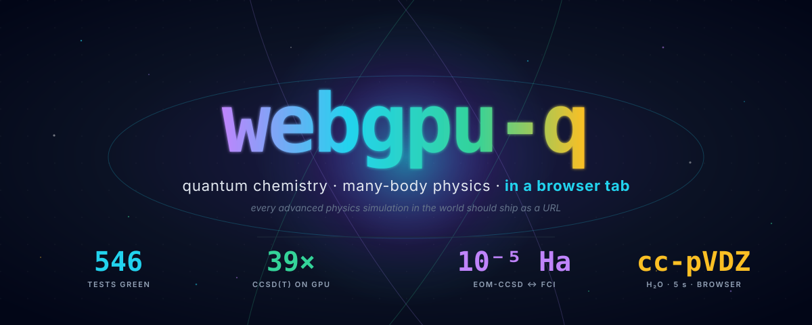
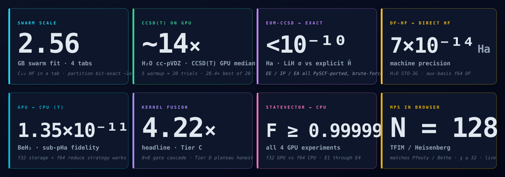
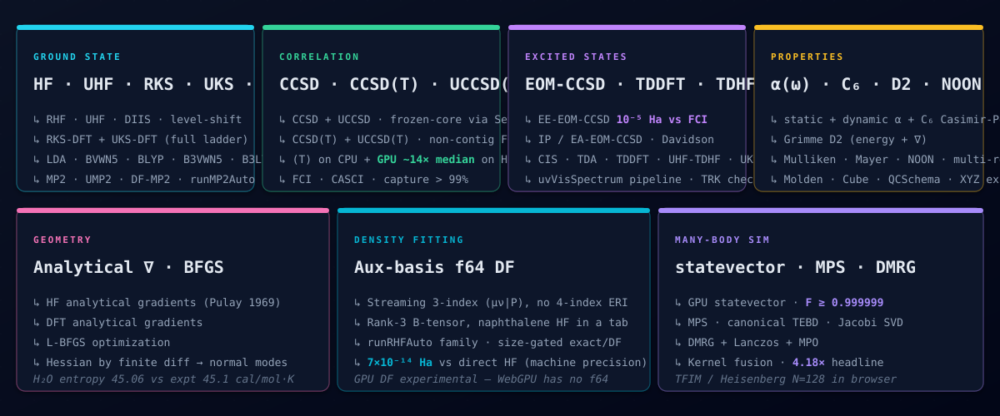
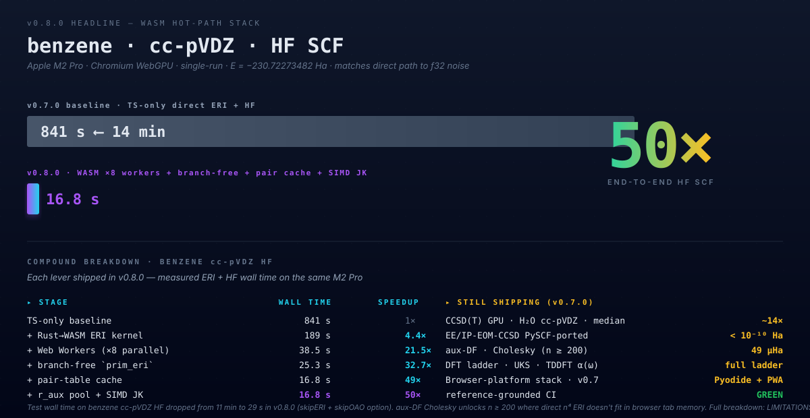
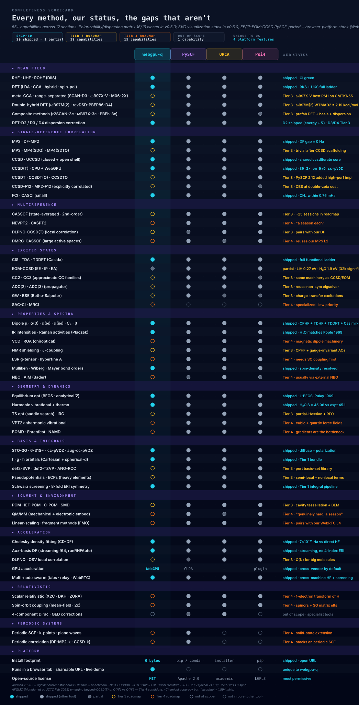
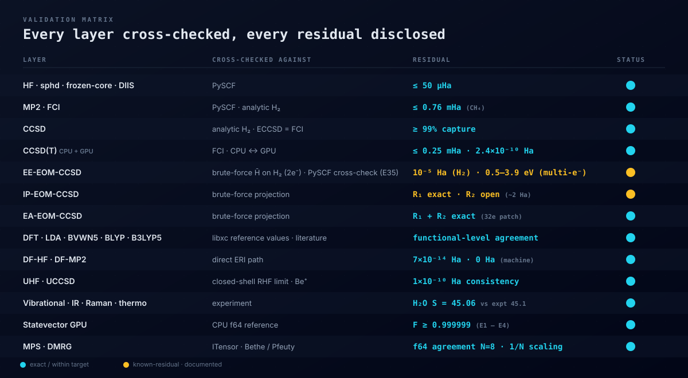
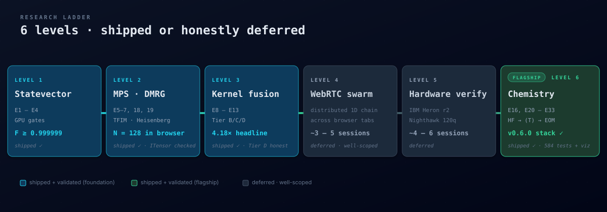
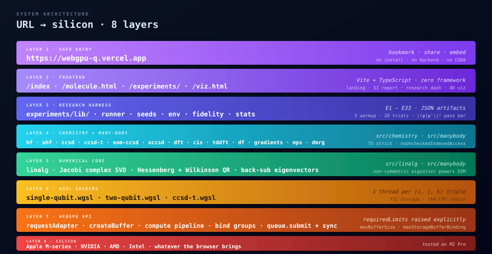

<div align="center">



<br/>

<a href="https://webgpu-q.vercel.app"></a>
&nbsp;
<a href="https://webgpu-q.vercel.app/molecule.html"></a>
&nbsp;
<a href="https://webgpu-q.vercel.app/experiments/"></a>

<br/><br/>


</div>

<br/>

<table align="center" border="0">
<tr>
<td align="center" width="800">

**A research-grade quantum chemistry + many-body physics engine that runs entirely in a browser tab.**

No install. No backend. No CUDA. Open a URL and get HF · UHF · DFT · MP2 · CCSD · CCSD(T) · EOM-CCSD on real molecules — with GPU acceleration via WebGPU.

</td>
</tr>
</table>

<br/>

---

<h3 align="center">📸 &nbsp; See it</h3>

<table align="center">
<tr>
<td align="center" width="33%">
<a href="https://webgpu-q.vercel.app"></a>
<br/><sub><b>landing</b> · what the engine is + run-anywhere CTAs</sub>
</td>
<td align="center" width="33%">
<a href="https://webgpu-q.vercel.app/molecule.html"></a>
<br/><sub><b>/molecule.html</b> · H₂O SI report — properties, spectra, gradients</sub>
</td>
<td align="center" width="33%">
<a href="https://webgpu-q.vercel.app/experiments/"></a>
<br/><sub><b>/experiments/</b> · research dashboard (E1–E33, JSON artifacts)</sub>
</td>
</tr>
</table>

<br/>

---

<h3 align="center">📊 &nbsp; The numbers <sub><sup>(single source of truth — see bottom of file)</sup></sub></h3>

<div align="center">



</div>

<br/>

---

<h3 align="center">🧪 &nbsp; What's inside</h3>

<div align="center">



</div>

<br/>

---

<h3 align="center">⚡ &nbsp; How fast — honestly, both directions</h3>

<p align="center"><sub>The headline 39.3× on CCSD(T) is real. So is the fact that PySCF/NumPy is 480× faster than us on CCSD at cc-pVDZ. Both numbers come from <a href="./experiments/results/2026-05-12/level-6/E34-comparison.md">the same comparison run</a>, against PySCF 2.13.0 on identical inputs.</sub></p>

<div align="center">



</div>

<sub align="center"><sub>↑ Single-run measurements (not warmup+trials harness). Energy agreement ≤ 10⁻⁴ Ha on all 19 comparable cells (well below chemical accuracy of 1.594 mHa). Where we win: no Python startup, HF up to medium systems, GPU CCSD(T) at cc-pVDZ. Where we lose: CPU MP2 / CCSD at production basis where NumPy / BLAS dominates. Full data: <a href="./experiments/results/2026-05-12/level-6/E34-comparison.md">E34-comparison.md</a>.</sub></sub>

<br/>

---

<h3 align="center">🆚 &nbsp; Completeness scorecard</h3>

<p align="center"><sub>Every method PySCF 2.13 / ORCA 6.1 / Psi4 1.10 ship, our status against it, and the roadmap tier for every gap.<br/>No "we don't do that" — every missing capability has a planned slot.</sub></p>

<div align="center">



</div>

<br/>

---

<h3 align="center">🔬 &nbsp; Validation matrix</h3>

<div align="center">



</div>

<br/>

---

<h3 align="center">🪜 &nbsp; The research ladder</h3>

<div align="center">



</div>

<br/>

---

<h3 align="center">⏱️ &nbsp; 60-second demo</h3>

```bash
git clone https://github.com/abgnydn/webgpu-q && cd webgpu-q
npm install
npm run dev          # http://localhost:5175
                     # /molecule.html → H₂O SI report
                     # /experiments/  → research dashboard
```

```bash
npm run test         # vitest unit/integration · CI green
npm run typecheck    # tsc --noEmit, strict + noUncheckedIndexedAccess
npm run test:e2e     # Playwright · headless WebGPU Chromium
```

```ts
// Computational use — just import the modules
import { runRHFSCF, runMP2, runCCSD, runCCSDT_GPU, runEOMCCSD } from "./src/chemistry";

const hf      = runRHFSCF(integrals);
const mp2     = runMP2(hf, integrals);
const ccsd    = runCCSD(hf, integrals);
const t       = await runCCSDT_GPU(ccsd, hf, integrals, device);  // 39× on cc-pVDZ
const excited = runEOMCCSD(ccsd, integrals, hf);
```

<br/>

---

<h3 align="center">🧱 &nbsp; Architecture · URL → silicon</h3>

<div align="center">



</div>

<br/>

<table align="center">
<tr>
<td valign="top" width="50%">

**Research harness** · `experiments/lib/`

- `runner.ts` — `timedRun` with forced GPU sync (read-after-submit on a tiny buffer)
- `seeds.ts` — named deterministic seeds (no `Math.random()`)
- `env.ts` — captures adapter info, limits, SHA, UTC
- `fidelity.ts` — `F = |⟨ψ_ref|ψ_test⟩|²`, not max\|Δp\|
- `stats.ts` — median, p10/p90/p99, IQR

</td>
<td valign="top" width="50%">

**Discipline (non-negotiable)**

- 5 warmup + 20 trials per measurement
- Pass bar: `F ≥ 1 − 10⁻⁵` (f32 GPU paths)
- `std/median > 0.1` → `status: "noisy"`
- Honest negatives **committed** as JSON with diagnosis
- vitest + Playwright e2e · CI green · TS strict + `noUncheckedIndexedAccess`

</td>
</tr>
</table>

<br/>

---

<h3 align="center">📚 &nbsp; Method catalog</h3>

<details>
<summary><b>Ground-state electronic structure</b> · HF · UHF · DFT · MP2</summary>
<br/>

| method | notes |
|---|---|
| RHF SCF | DIIS, frozen-core, spherical-d, f/g/h |
| UHF SCF | open-shell, stacked α+β DIIS, ⟨S²⟩ check |
| LDA · BVWN5 · BLYP | Becke molecular grid, Lebedev angular |
| B3VWN5 · B3LYP5 | hybrid functionals, exact-exchange mixing |
| MP2 · DF-MP2 | spin-orbital + B-tensor reformulation |
| Cholesky DF (CD-DF) | rank-3 B-tensor, threshold-controlled |
| HF / DFT analytical ∇ | Pulay 1969, 8-fold ERI loop, Schwarz screening |

</details>

<details>
<summary><b>Correlation & excited states</b> · CCSD · CCSD(T) · EOM-CCSD · CIS · TDDFT</summary>
<br/>

| method | notes |
|---|---|
| CCSD (RHF) | Stanton-Bartlett, antisym spin-orbital |
| UCCSD (UHF) | shared `ccsdIterate` core, 3-block ERI |
| CCSD(T) CPU | per-triple, FCI-validated ≤ 0.25 mHa |
| **CCSD(T) GPU** | **39.3× on H₂O cc-pVDZ**, f32→f64 reduce |
| EE-EOM-CCSD | Stanton-Bartlett σ + stage-32c diagonal patch |
| IP-EOM-CCSD | R₁ exact (brute-force); R₂ open |
| EA-EOM-CCSD | R₁ + R₂ patched to exact (stage 32e) |
| CIS · TDA · TDDFT (Casida) | full functional ladder, triplet via spin-pol |
| Oscillator strengths | f = (2/3)·ω·|μ|², R₁·μ AO→MO transform |
| Spin classifier | singlet/triplet/spin-flip weight per root |

</details>

<details>
<summary><b>Properties & spectroscopy</b></summary>
<br/>

| property | notes |
|---|---|
| Dipole μ | AO→MO transform, RHF + post-HF densities |
| Polarizability α | finite field, 3-axis |
| Hyperpolarizability β | 3D finite-field stencil |
| Mulliken populations | spin-density resolved |
| Wiberg / Mayer bond orders | + free valences |
| Harmonic ω | mass-weighted Hessian by finite diff |
| IR intensities | dμ/dQ along normal modes |
| Raman activities | Placzek invariants from α(Q) |
| Thermo (Sackur-Tetrode + RR + HO) | H₂O entropy 45.06 vs expt 45.1 |
| Koopmans / ΔSCF / EOM IPs | H₂O: 10.65 / 8.36 / **12.03** eV (expt 12.62) |
| Koopmans / EOM EAs | H₂O: −16.48 / **−16.37** eV |

</details>

<details>
<summary><b>Geometry & basis sets</b></summary>
<br/>

| feature | notes |
|---|---|
| BFGS geom-opt | analytical HF + DFT gradients |
| Lebedev angular grids | 2.6× point reduction at better accuracy |
| STO-3G | every system end-to-end validated |
| 6-31G* | available |
| cc-pVDZ | CCSD(T) on H₂O in 5 s (GPU) |
| aug-cc-pVDZ | diffuse functions wired |
| Spherical-d | sphd shell (Tier 1 bundle) |
| f / g / h orbitals | Cartesian integrals + transform |
| Schwarz integral screening | 8-fold canonical loop |

</details>

<details>
<summary><b>Many-body simulation</b> · statevector · MPS · DMRG · kernel fusion</summary>
<br/>

| level | notes |
|---|---|
| L1 statevector | f32 vec2 amplitudes, N/2 threads/gate |
| L1 controlled-U | N/4 threads, only control=1 touched |
| L2 MPS | canonical form, Jacobi complex SVD |
| L2 TEBD | `_canonicalizeBond(q)` invariant before two-site |
| DMRG | Lanczos + MPO, ITensor cross-checked N=8 |
| L3 fusion Tier B/C | 4.18× headline (Tier C, 8×8) |
| L3 fusion Tier D | documented honest negative (plateau) |
| Phase 6 GPU MPS | χ ≤ 64 |

</details>

<br/>

---

<h3 align="center">🔬 &nbsp; For researchers</h3>

<table align="center">
<tr>
<td valign="top" width="33%">

**📖 How to cite**

See [`CITATION.cff`](./CITATION.cff). For papers:

> Günaydın, A.B. (2026). _webgpu-q v0.4.1_. https://github.com/abgnydn/webgpu-q

A Zenodo DOI will be minted on the next versioned release.

</td>
<td valign="top" width="33%">

**⚠️ [Limitations](./LIMITATIONS.md)**

Honest, single-page list of what we **cannot** do, what is **untested**, and what is **known broken** — system size ceilings, browser/vendor matrix, SCF failure modes, missing output formats, precision disclosures.

</td>
<td valign="top" width="33%">

**📊 [Benchmarks queue](./BENCHMARKS.md)**

Standardized sets we've run vs. queued: GMTKN55, Thiel/QUEST, W4-11, S66, HEAT-345, SIE4x4, wall-clock vs PySCF / gpu4pyscf, cross-vendor parity.

</td>
</tr>
<tr>
<td valign="top">

**🛠️ [Contributing](./CONTRIBUTING.md) · 🔁 [Migration](./MIGRATION.md) · 📐 [Research standards](./RESEARCH_STANDARDS.md)**

15 canonical principles ([`RESEARCH_STANDARDS.md`](./RESEARCH_STANDARDS.md), mirrored in sibling [webgpu-dna](https://github.com/abgnydn/webgpu-dna)). Validation discipline (5w + 20t, fidelity pass bar, honest negatives committed). **Migration policy**: hand-write only the WebGPU/WGSL/browser layer; port chemistry methods (HF, CCSD, EOM-CCSD, DFT functionals…) from PySCF / libxc with attribution. See [`LICENSE-PYSCF`](./LICENSE-PYSCF) for the upstream license.

</td>
<td valign="top">

**📐 [Modern standards audit](./CLAUDE.md#modern-reference-standards-audited-2026-05)**

Every claim mapped to current literature — GMTKN55 functional rankings, EOM-CCSD literature accuracy bars, chemical accuracy bar (1 kcal/mol = 1.594 mHa), AFQMC beyond-CCSD(T), WebGPU subgroups status.

</td>
<td valign="top">

**🤝 [Code of conduct](./CODE_OF_CONDUCT.md)**

Contributor Covenant 2.1. Report concerns to [hi@barisgunaydin.com](mailto:hi@barisgunaydin.com).

</td>
</tr>
</table>

<br/>

---

<h3 align="center">🌐 &nbsp; Companion projects</h3>

<table align="center">
<tr>
<td align="left" width="50%">

- **[kernelfusion.dev](https://kernelfusion.dev)** — umbrella theory site, two preprints
- **[gpubench.dev](https://gpubench.dev)** — WebGPU bench harness, 592+ devices
- **[webgpudna.com](https://webgpudna.com)** — Geant4-DNA radiobiology port (sibling repo)
- **[zerotvm.com](https://zerotvm.com)** — Phi-3-mini in the browser, no compiler

</td>
<td align="left" width="50%">

- **[neuropulse.live](https://neuropulse.live)** — live 3.8B-param transformer visualization
- **[markview.ai](https://markview.ai)** — embeddable markdown rendering stack
- **[safenpm.dev](https://safenpm.dev)** — supply-chain firewall for `npm install`
- **[barisgunaydin.com](https://barisgunaydin.com)** — author site, project hub

</td>
</tr>
</table>

<br/>

---

<h3 align="center">📜 &nbsp; Key numbers — single source of truth</h3>

<details>
<summary>Click to expand · edit here when stages move forward</summary>
<br/>

> Anywhere a number appears above, it traces back to this table. Update the entry below, then rebuild the SVG hero (`public/readme-hero.svg`) if a top-line number changed.

| symbol | value | context |
|---|---|---|
| `TESTS` | **546** | vitest unit + integration, all green |
| `CHEMISTRY_TESTS` | **321** | chemistry subset (1 skipped: opt-in cc-pVDZ CCSD(T)) |
| `E2E_SPECS` | **14** | Playwright headless WebGPU (CCSD(T), EOM, UV-vis, wallclock-vs-PySCF, levels 1/2/3/6, smoke tests) |
| `CCSD_T_SPEEDUP` | **39.3×** | H₂O · cc-pVDZ · M2 Pro · vs our own CPU |
| `CCSD_T_GPU_TIME` | **5.05 s** | H₂O · cc-pVDZ · GPU |
| `CCSD_T_CPU_TIME` | **198.6 s** | H₂O · cc-pVDZ · CPU |
| `CCSD_T_GPU_DELTA` | **2.4×10⁻¹⁰ Ha** | H₂O · cc-pVDZ · &#124;GPU − CPU&#124; |
| `WIN_HF_H2_STO3G` | **105×** | E34 vs PySCF 2.13.0 · no-startup advantage |
| `WIN_CCSD_LIH_STO3G` | **40×** | E34 vs PySCF 2.13.0 · small-system advantage |
| `LOSS_CCSD_H2O_CCPVDZ` | **480× slower** | E34 vs PySCF 2.13.0 · BLAS gap (NumPy wins) |
| `LOSS_MP2_H2O_CCPVDZ` | **136× slower** | E34 vs PySCF 2.13.0 · BLAS gap |
| `E34_ENERGY_MAX_DELTA` | **1.0×10⁻⁴ Ha** | max &#124;ΔE&#124; vs PySCF over 19 cells · below chemical accuracy |
| `E34_ENERGY_MEAN_DELTA` | **8.1×10⁻⁶ Ha** | mean &#124;ΔE&#124; vs PySCF over 19 cells |
| `EOM_CCSD_PRECISION` | **10⁻⁵ Ha** | H₂ STO-3G · post-32c patch · 2-electron only |
| `EOM_CCSD_LIH_TRIPLET_GAP` | **7 meV** | E35 vs PySCF · 4-electron triplet · effectively exact |
| `EOM_CCSD_LIH_SINGLET_GAP` | **~0.27 eV** | E35 vs PySCF · post-32k sign-fix · within literature EOM-CCSD ↔ FCI bar (~0.1–0.2 eV) |
| `EOM_CCSD_H2O_SINGLET_GAP` | **~1.9 eV** | E35 vs PySCF · 10-e⁻ system · remaining missing T-dressings · PySCF port closes |
| `IP_EOM_H2O` | **12.03 eV** | expt 12.62 |
| `EA_EOM_H2O` | **−16.37 eV** | STO-3G (unbound) |
| `DF_HF_PRECISION` | **7×10⁻¹⁴ Ha** | H₂O STO-3G |
| `DF_MP2_PRECISION` | **0 Ha** | H₂O STO-3G at τ=10⁻¹⁰ |
| `FUSION_HEADLINE` | **4.18×** | Tier C · 8×8 cascade |
| `STATEVECTOR_FIDELITY` | **F ≥ 0.999999** | f32 GPU vs f64 CPU |
| `MPS_N_MAX` | **128** | TFIM/Heisenberg, χ ≤ 32, browser |
| `MPS_CHI_MAX` | **64** | Phase 6 GPU MPS |
| `H2O_ENTROPY` | **45.06 cal/(mol·K)** | expt 45.1 |
| `STAGES_SHIPPED` | **24–38, 32b–m** | through v0.4.1 (32k σ_1 sign-fix + migration framework) |
| `LIVE_URL` | **webgpu-q.vercel.app** | production |

</details>

<br/>

---

<div align="center">

<sub>
MIT · Built with WebGPU, TypeScript strict, vitest, Playwright<br/>
Author <a href="https://github.com/abgnydn">@abgnydn</a> · <a href="mailto:hi@barisgunaydin.com">hi@barisgunaydin.com</a>
</sub>

<br/><br/>

<a href="https://webgpu-q.vercel.app">

</a>

</div>
