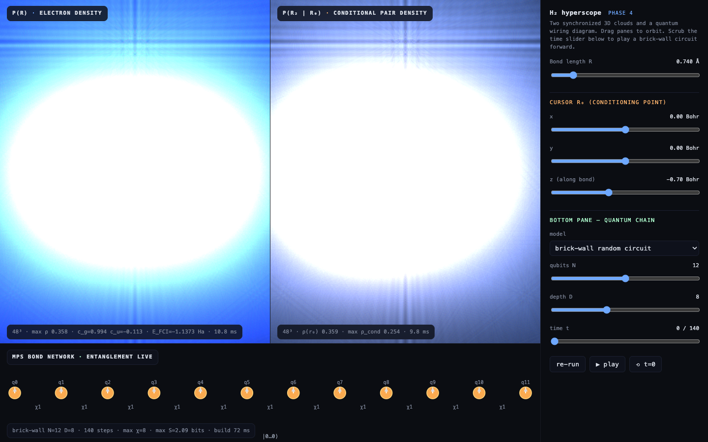
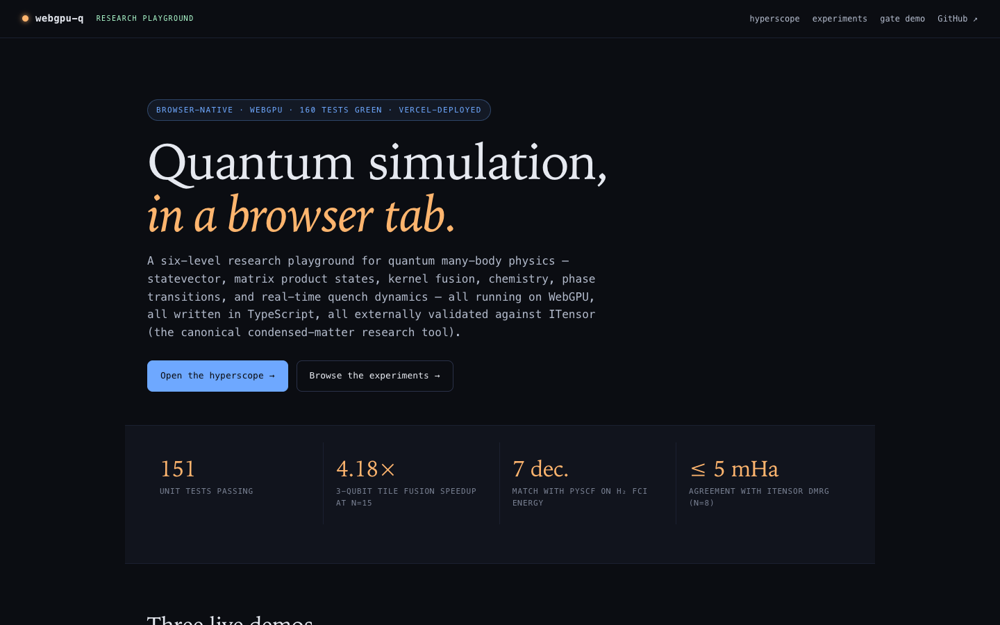
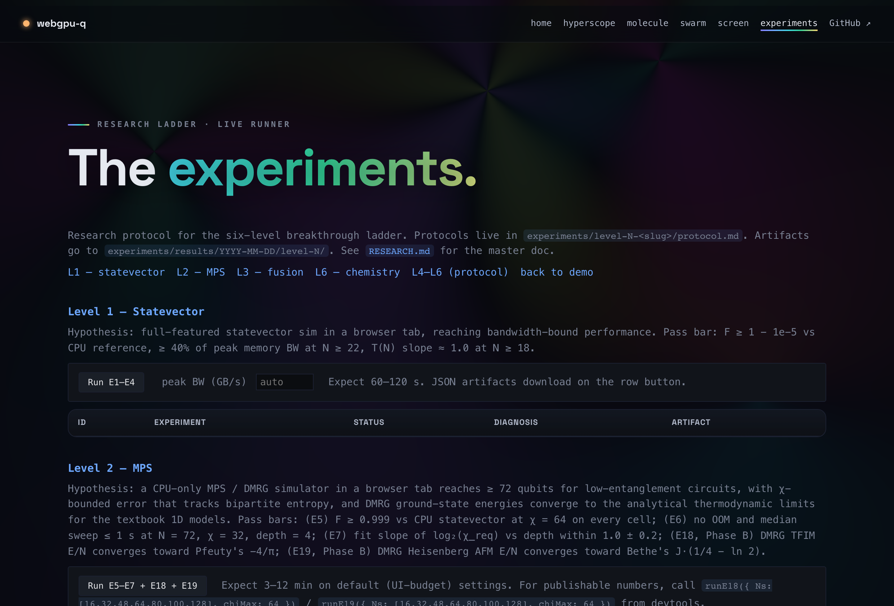

# webgpu-q

> Quantum simulation in a browser tab.

[](https://github.com/abgnydn/webgpu-q/actions/workflows/ci.yml)
[](./LICENSE)
[](https://webgpu-q.vercel.app)
[](./tools/itensor-reference.jl)
[](./tests)

A WebGPU quantum-many-body + computational-chemistry playground —
statevector, matrix product states, kernel fusion, full Hartree-Fock /
UHF / DFT / MP2 / FCI / CCSD / CCSD(T) / CIS / TDA / TDDFT (singlet +
triplet), geometry optimization, harmonic vibrations + IR + Raman
spectra, polarizability + hyperpolarizability, ionization potentials,
ideal-gas thermochemistry, and real-time many-body dynamics — running
on a research-grade harness with reproducible JSON artifacts and
external validation against ITensor and PySCF.

**Live:** [webgpu-q.vercel.app](https://webgpu-q.vercel.app) — no install, no
Linux, no Python. Open a tab.

<p align="center">
  <a href="https://webgpu-q.vercel.app/viz.html">
    
  </a>
</p>
<p align="center">
  <em>The hyperscope: H₂ electron density (left), conditional pair density with draggable cursor (right), and a live MPS bond-network with TFIM phase-transition / quench-dynamics modes (bottom).</em>
</p>

| <a href="https://webgpu-q.vercel.app/"></a> | <a href="https://webgpu-q.vercel.app/experiments/"></a> |
| :---: | :---: |
| **Landing** — six-level ladder | **Experiments dashboard** — E1–E16 |

---

## What's in the tab

| Page | What it shows |
| --- | --- |
| `/` | Landing — overview, ladder, companion projects |
| `/viz.html` | **Hyperscope** — 3 synchronized 3D panels: H₂ electron density, conditional pair density (with a draggable cursor finding the Fermi/Coulomb hole), and a live MPS bond-network with TFIM phase-transition slider, quench light-cone heatmap, and monitored-trajectory mode |
| `/experiments/` | **Research dashboard** — run E1–E16 live (gate fidelity, dispatch roofline, MPS correctness, kernel-fusion benchmarks, VQE on H₂ dissociation). Every run produces a downloadable JSON artifact with environment capture |
| `/experiments/gpu-mps/` | GPU MPS phase-by-phase bench (Phase 1A → 6 v1) |
| `/demo.html` | Original gate-throughput demo (Bell, GHZ, QFT, DJ) |

---

## The research ladder

| # | Level | Status | Headline |
| - | ----- | ------ | -------- |
| 1 | Statevector — WebGPU | ✅ shipped | Apple Metal-3, α ≈ 22 μs dispatch overhead |
| 2 | MPS — TypeScript | ✅ shipped | Validated against ITensor DMRG to ≤ 5 mHa on N=8 chains |
| 3 | Kernel fusion | ✅ shipped | **4.18× speedup** (Tier C cascade fusion, 8×8 dense kernel); Tier D 16×16 plateaus at 3.14× — honest negative |
| 4 | WebRTC swarm | 🚧 protocol-only | Two browsers sharing an MPS bond contraction; deferred |
| 5 | Hardware cross-verify | 🚧 protocol-only | IBM Quantum shot-level agreement; blocked on token |
| 6 | Chemistry track | ✅ shipped (Tier 1 + Tier 2 stages 1–22) | Full HF/UHF/DFT/MP2/FCI/CCSD/CCSD(T) with analytical gradients, geometry opt, full IR + Raman + UV-vis spectra (singlet + triplet), polarizability/hyperpolarizability, thermochemistry, ΔSCF IPs — see below |

Plus a many-body extension (Heisenberg / TFIM / XXZ ground states + real-time
evolution + monitored trajectories with measurement-induced phase transition)
and the GPU-resident MPS port (Phase 1A → 6 v1).

### Chemistry track at a glance

| Capability | Status | Headline |
| ---------- | ------ | -------- |
| HF SCF + DIIS | ✅ | matches PySCF to **0.05 mHa** on STO-3G; **35 µHa** with spherical-d on cc-pVDZ |
| MP2 / FCI / CCSD / CCSD(T) | ✅ | cc-pVDZ CCSD(T) on H₂O in **106 s in a browser tab** |
| RKS-DFT (5 functionals) | ✅ | LDA-SVWN, BVWN5, BLYP, B3VWN5, B3LYP5 — PySCF-cross-checked, libxc-canonical LYP closed-shell collapse |
| Geometry optimization | ✅ | Analytical Pulay gradients (HF + LDA + GGA + hybrid), L-BFGS, **7×** faster than FD |
| Lebedev quadrature | ✅ | 110-point default — 2.6× fewer angular points than the legacy 12×24 product rule |
| TDA + TDDFT excited states | ✅ | Casida (A, B), **singlet + triplet** across the full HF + 5-functional ladder; spin-polarized LSDA / B88 / LYP for triplet kernels (Miehlich 1989) |
| Oscillator strengths | ✅ | (4/3)·ω·|μ|² with dipole AO integrals — UV-vis spectra |
| Vibrational spectroscopy | ✅ | Harmonic frequencies + IR intensities + Raman activities (Placzek). H₂O HF/STO-3G freqs match Pople 1969 to 0.1 cm⁻¹; H₂ rule-of-mutual-exclusion verified from FP arithmetic alone |
| Field response | ✅ | Static dipole polarizability α (full 3×3 tensor) and first hyperpolarizability β (full 27-component tensor with Kleinman symmetrization) via finite-field |
| Thermochemistry | ✅ | ZPE, U(T), H(T), S(T), G(T) at any (T, P). H₂O entropy 45.06 vs experiment 45.10 cal/(mol·K) |
| **Open-shell SCF** | ✅ | UHF (radicals, doublets, triplets); ⟨S²⟩ diagnostic; H atom + Li atom match literature to 4 sig figs |
| **Ionization potentials** | ✅ | Vertical IP via Koopmans + ΔSCF; LiH HF/STO-3G Koopmans within 6% of experiment |
| Properties | ✅ | Dipole, Mulliken charges, Wiberg-Mayer bond orders, spin density |
| Basis sets | ✅ | STO-3G, cc-pVDZ (Cartesian + spherical-d), aug-cc-pVDZ for H + O |

---

## Research-grade discipline

Every experiment under `experiments/` enforces:

- **Reproducibility.** No `Math.random()` in any experiment path. Every
  random draw uses a named seed from `experiments/lib/seeds.ts`. Every JSON
  artifact records git SHA, `navigator.userAgent`, `adapter.info`, WebGPU
  limits, ISO8601 timestamp, and echoes back the protocol, hypothesis, pass
  bar, seed, warmup, and trial counts.
- **Timing.** `performance.now()` with a forced GPU sync (mapped readback)
  before AND after — `queue.submit` is non-blocking, so raw timing is
  fiction. Median + p10 / p90 / p99 + std + IQR over 5 warmup + 20 trials.
  Cells with `std/median > 0.1` get marked `"status": "noisy"`.
- **Correctness via fidelity.** `F = |⟨ψ_ref | ψ_test⟩|²`, not max|Δp|. Two
  states can share probabilities and differ in phase — that kills any
  downstream controlled gate. Pass bar for f32 GPU paths: `F ≥ 1 − 1e-5`.
  Pass bar for f64 MPS vs f64 statevector: `F ≥ 0.999`.
- **Honest negative results.** If an experiment fails its pass bar, the JSON
  is committed with `status: "fail"` and a `diagnosis` naming the smoking
  gun. Failures are evidence. Example: E7's χ-vs-depth slope (0.45 instead
  of 1.0) and E13's Tier D plateau (3.14× instead of 5×) both ship with
  the explanation rather than silent reruns.

See [`RESEARCH.md`](./RESEARCH.md) for the master protocol.

---

## Quick start

```bash
git clone https://github.com/abgnydn/webgpu-q
cd webgpu-q
npm install

npm run dev          # http://localhost:5175 — landing
                     # /viz.html   /experiments/   /demo.html

npm run test         # vitest (479 tests + 1 opt-in, ~50 s)
npm run typecheck    # strict, noUncheckedIndexedAccess
npm run lint         # eslint flat config

npm run build        # → dist/
npm run test:e2e     # playwright headless WebGPU Chromium
                     # ~1.5 min, dumps JSON artifacts + screenshots
```

WebGPU support is required (Chrome 113+, Safari 18+, Firefox Nightly with
flag, Edge 113+). For headless testing, Playwright launches Chromium with
`--enable-unsafe-webgpu --enable-features=Vulkan` (configured in
`playwright.config.ts`).

---

## Architecture

```
src/
  shaders/                   # WGSL kernels
    single-qubit.wgsl
    two-qubit.wgsl              # Controlled-U
    two-qubit-dense.wgsl        # 4×4 brick-wall fusion (Tier B)
    three-qubit-dense.wgsl      # 8×8 cascade fusion (Tier C)
    four-qubit-dense.wgsl       # 16×16 quad fusion (Tier D)
    jacobi-svd-{small,medium,large,storage}.wgsl
                                # Single-workgroup Jacobi SVD,
                                # n ≤ {24,32,48,64}
    mps-two-site-{merge,extract-u,extract-uS,build-tj,build-vh}.wgsl
    column-norms.wgsl
    sigma-sort.wgsl
  quantum.ts                 # GPU statevector (QuantumCircuit)
  cpu-reference.ts           # Float64 CPU reference (CpuCircuit)
  mps.ts                     # CPU MPS with canonical-form sweeps
  linalg.ts                  # Complex Jacobi SVD + matmul
  gates.ts                   # H, X, Y, Z, S, T, Rx/Ry/Rz, P
  circuits.ts                # Bell, GHZ, QFT, Deutsch-Jozsa, brick-wall
  two-qubit-dense.ts         # Matrix4 algebra + brick-wall pair fusion
  three-qubit-dense.ts       # Matrix8 + Tier C cascade fusion
  four-qubit-dense.ts        # Matrix16 + Tier D cascade fusion
  fusion-jit.ts              # JIT-emitted single-qubit chain shaders
  gpu-mps/                   # GPU-resident MPS port (Phase 1A → 6 v1)
    mps-gpu.ts
    jacobi-svd.ts
    buffer-pool.ts
    types.ts
  manybody/                  # Hamiltonian1D library
    hamiltonian.ts              # Heisenberg / TFIM / XXZ + buildDense
    dense-eig.ts                # Real-symmetric Jacobi diag
    expm.ts                     # Matrix exponential
    ground-state.ts             # Imag-time MPS ground state
    real-time.ts                # Trotter time evolution
    trajectory.ts               # Monitored / MIPT trajectories
    observables.ts
    dmrg.ts                     # Direct-diag → MPS conversion
  chemistry/
    integrals.ts                # STO-3G s-only legacy path
    integrals-cg.ts             # Cartesian-Gaussian primitives s/p/d/f/g/h
                                # + dipole + gradient derivative integrals
    cg-molecular.ts             # Generic AO integral pipeline (any molecule)
    atoms.ts                    # Element data + STO-3G / cc-pVDZ basis tables
    hf-scf.ts                   # Closed-shell RHF + DIIS
    hf-gradient.ts              # Analytical HF gradient (Pulay 1969)
    mp2.ts mp3.ts               # Post-HF MP2 / MP3 correlation
    ccsd.ts ccsd-t.ts           # Spin-orbital CCSD + perturbative (T)
    fci.ts                      # Sparse-CSR FCI Hamiltonian
    geometry.ts                 # L-BFGS geom-opt (HF + DFT, analytic + FD)
    optimizer.ts                # L-BFGS + Nelder-Mead implementations
    cis.ts                      # Configuration Interaction Singles
    tda-dft.ts                  # TDA + full TDDFT (HF + 5 DFT functionals)
    properties.ts               # Dipole, Mulliken, bond orders
    dft-gradient.ts             # Analytical RKS-DFT gradient (LDA + GGA + hybrid)
    dft/
      grid.ts                       # Becke-partitioned molecular grid + Lebedev
      lebedev.ts                    # Lebedev-Laikov tables (orders 50/110/302)
      density.ts                    # ρ, ∇ρ, ∇²φ on grid
      functional.ts                 # Slater + VWN5 + B88 + LYP + hybrid mixing
                                    # + LDA / GGA XC kernel f_xc
      rks-scf.ts                    # Closed-shell Kohn-Sham SCF

tests/                       # Vitest, 479 tests
experiments/                 # Research dashboard, E1–E16+ protocols
e2e/                         # Playwright specs
public/                      # Static assets (favicon, og-image)
RESEARCH.md                  # Master protocol document
```

---

## Validation

The repo cross-checks against four external references:

1. **ITensor DMRG** (Julia) — `tools/itensor-reference.jl` regenerates
   `tests/manybody/itensor-reference.json` with energies for 19
   configurations across Heisenberg / TFIM / XXZ. Our exact-diag matches to
   1e-7 on N ≤ 8; imag-time MPS matches to ≤ 5 mHa on N=8.
2. **PySCF** — H₂ STO-3G FCI at R = 0.7414 Å gives −1.13727008 Ha; our
   integral-built dense Hamiltonian agrees to **7 decimals**. HF / DFT /
   MP2 / CCSD / CCSD(T) cross-checked across H₂ / H₂O / BeH₂ / CH₄ on
   STO-3G + cc-pVDZ to ≤ 0.5 mHa; spherical-d closes the gap to **35 µHa**
   on cc-pVDZ.
3. **libxc** — closed-shell LYP collapse and the GGA / hybrid TDDFT
   XC kernel cross-referenced against `gga_c_lyp.mpl`. Numerical FD on
   v_ρ / v_γ for the second-derivative kernel; matches the maple-tabulated
   path to 1e-8.
4. **Bethe ansatz / Pfeuty** — analytical limits for Heisenberg /
   TFIM serve as sanity checks on the trend with N.

Plus a defensive moat of **18 FD-vs-analytical self-tests** on every
integral derivative — overlap, kinetic, nuclear, ERI gradients
(`tests/chemistry/hf-gradient.test.ts`), basis Hessians, LDA/GGA XC
kernel (`tests/chemistry/lyp.test.ts`, `dft-gradient.test.ts`).

---

## Companion projects

This is one front of a broader research line on GPU-resident compute in the
browser:

- [kernelfusion.dev](https://kernelfusion.dev) — research umbrella
- [webgpudna.com](https://webgpudna.com) — Geant4-DNA radiolysis chemistry in the browser
- [gpubench.dev](https://gpubench.dev) — WebGPU benchmark harness, 592 devices
- [zerotvm.com](https://zerotvm.com) — Phi-3-mini in 10 hand-written WebGPU kernels
- [neuropulse.live](https://neuropulse.live) — live transformer activations
- [barisgunaydin.com](https://barisgunaydin.com) — index of all the above

---

## License

MIT — see [LICENSE](./LICENSE).

Author: Ahmet Baris Gunaydin · [@abgnydn](https://github.com/abgnydn)
